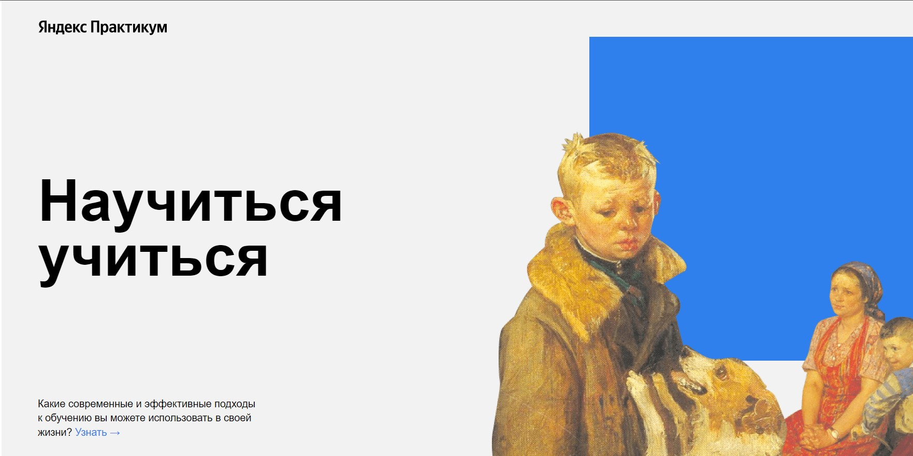
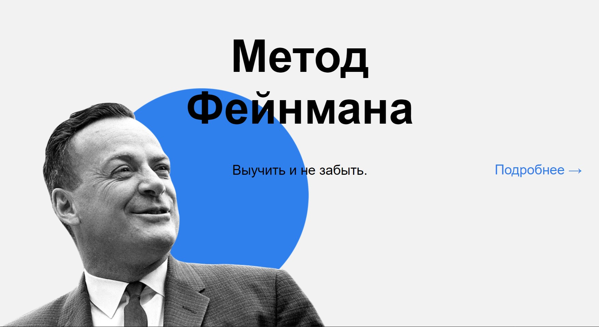
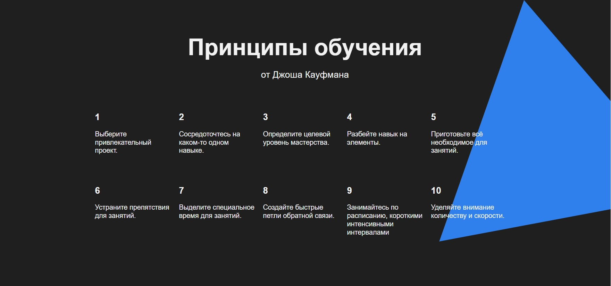

# Учусь учиться с Яндекс.Практикумом
___

* Пока что это обычный лендинг с сылками и красивыми картиночками. Код написан с использованием методологии БЭМ. Не знаю, что тут ещё написать, но пока что просто продемонстрирую, что я научилась синтаксису Markdown.

> Так же хочется показать пару скриншотов самой работы для тех, кто не хочет скачивать проект:





* В дальнейшем, хотелось бы сделать анимации при помощи css (ну и js соответственно).

> Пример кода для трансформации мальчика с двойкой (можно сделать условное "оживление" мальчика - плавное увеличение картинки при наведении мыши). Чтобы код работал, надо обернуть изображение в див, с классом (например "header__main-illustration"), а класс самого изображения переименовать в header__main-illustration-pic и прописать трансформацию:

```css
.header__main-illustration:hover .header__main-illustration-pic {
  transform: scale(1.2);
}
```
